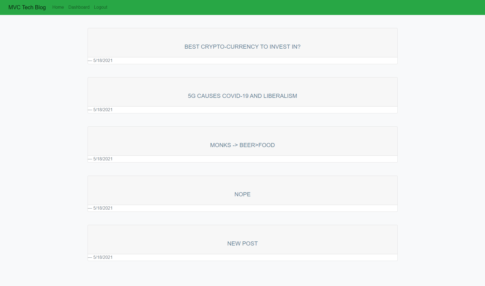

## Live Deploy
https://blog-site-14.herokuapp.com/

# 14-Tech-Blog

# Contact
Vygoth
JeremyJoanet@Protonmail.com

## Description
A webapp that allows you to create an account, log in, view blog posts, create blog posts, and comment on posts. This application was built using an MVC format, with handlebars to handle the html render. Users must be logged in to comment, post or view the dashboard. Data from this site is stored via Jaws_DB on Heroku with MySQL as it's database. 

## Table of Contents
- [Usage](#Usage)
- [Credits](#Credits)
- [Screenshot](#Screenshot)

## Usage
This application features a live deploy link found at the top of this README.

## Credits
Zach Duty, Michael Francisco, Matt Reisdorf

## Screenshot

